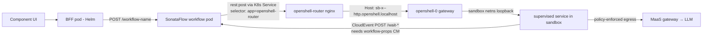

# Deployment Lessons Learned: OpenShift + MaaS + OpenShell + SonataFlow

Distilled from the deployment framework work (RHAIENG-6955, August 2026): three full
fresh-namespace deployment tests, and one earlier manual deployment cycle. Source material: the deployment logs and fix prompts.

**Audience:** future projects deploying on this stack, and future development in this project.
Many of these pitfalls produce *silent* or *misleading* failures — the value of this document
is knowing what a symptom actually means before spending days on the wrong diagnosis.

Related permanent docs: [`docs/openshell-agent-security.md`](../../docs/openshell-agent-security.md),
[`docs/sonataflow-orchestration.md`](../../docs/sonataflow-orchestration.md),
[`dev_docs/design/openshell-integration-findings.md`](../design/openshell-integration-findings.md),
[`deploy/README.md`](../../deploy/README.md).

---

## 1. OpenShell

OpenShell runs each service in a **supervised sandbox**: a gateway pod (`openshell-0`)
creates sandbox pods whose PID 1 is the OpenShell supervisor. The supervised command runs
inside a **separate network namespace** with policy enforcement on all egress. This
architecture is the single largest source of misdiagnosis on this stack.

### 1.1 The supervised-sandbox facts (memorize these)

| Fact | Consequence |
|---|---|
| The supervised process listens on the **sandbox netns loopback**, not the container's | `oc exec <sb> -- curl localhost:8080` **always fails** against a healthy service. This is by design, not a bug. |
| `oc logs` shows only supervisor output | The application's stdout/stderr (including Python tracebacks) is captured by the supervisor and **never appears in `oc logs`**. "Zero application logs" is normal, not evidence of a hang. |
| `oc exec` runs in the container namespace, outside the sandbox netns AND outside policy enforcement | Any connectivity test or service run via `oc exec` proves nothing about the supervised process's network reality — and bypasses OpenShell security entirely. |
| The supervisor does **not** restart a killed supervised command | `kill` the app process and the pod stays Running but serves nothing. The sandbox must be deleted and recreated. |
| The **routed health check is the only valid probe** | Verify via the openshell-router with a Host header: `curl -H "Host: <sb>--http.openshell.localhost" http://openshell-http:8080/health` from the router pod. |
| Sandboxes and supervised commands **survive CLI death** | The tunnel endpoint is the in-pod supervisor, not the laptop CLI attach process. No persistent terminal is needed. An entire "fundamental OpenShell problem" diagnosis was built on the opposite (wrong) assumption. |

A whole day was lost to services started via `oc exec` (after the supervised command failed):
they answered `oc exec curl` probes, so they *looked* healthy, but were invisible to the
gateway (502 everywhere) and ran as root outside all policy enforcement. **If you ever start
a service with `oc exec`, you have left the security model — the results are functionally
informative but prove nothing about the policed path.**

### 1.2 Shell portability (zsh vs bash) broke everything twice

The deploy scripts pass the sandbox command as `-- $command`. Under bash this word-splits;
under **zsh it does not** — the entire command string is passed as ONE argument, producing:

```
/bin/bash: line 1: uvicorn acp_writer...--port 8080: command not found
```

The supervised command fails → supervisor falls back to `sleep infinity` → pod Running,
nothing listening. A second zsh difference (`for x in $list` not splitting a newline list)
made sandbox deletion a silent no-op, so a "redeploy" left old-image pods running — which
looked like an env-var mystery until traced.

**Rules:**
- Pass sandbox commands as `-- sh -c "$command"` — a single quoted string, immune to splitting differences.
- If a script must run under zsh: `[ -n "${ZSH_VERSION:-}" ] && setopt SH_WORD_SPLIT`.
- macOS ships bash 3.2 — no `declare -A`. Also `status` is a read-only variable in zsh.
- When a deploy "didn't pick up" a variable, first verify the deploy actually did anything (delete → recreate can silently no-op).

### 1.3 Provisioning gotchas

- **JWT keys must be Ed25519**, not EC P-256 (`openssl genpkey -algorithm ed25519`). Wrong type gives `InvalidKeyFormat`.
- **The gateway.toml must be complete.** A config extracted through `head -30` silently lost six `[openshell.drivers.kubernetes]` lines. Missing `supervisor_sideload_method = "init-container"` made the gateway use OCI image volumes (needs kubelet ≥ 1.33) — sandboxes then failed *only on older nodes*, which looked exactly like a cluster infrastructure problem. Missing `sandbox_uid = 1001` changed which user the app ran as, tripping the supervision check. **Never truncate config extraction; when a symptom splits by node, diff the pod spec before blaming the node.**
- **Cluster-scoped RBAC outlives the namespace.** `setup-openshell.sh` creates ClusterRole + ClusterRoleBinding `<namespace>-openshell-tokenreview`. Deleting the namespace orphans them. `teardown-all.sh --full-wipe` removes them; a namespace abandoned without it leaves orphans an admin must find by name.
- **`openshell` CLI needs a port-forward** to `openshell-0:8080`. Stale port-forwards to a *different namespace* silently target the wrong cluster state — verify the forward's namespace before use, don't just check that the port answers.

### 1.4 Routing and services

- Sandboxed services are reached via the **openshell-router** (nginx). K8s Services for
  sandboxed pods must select `{app: openshell-router}` — NOT the pod labels. Helm-created
  services that select pod labels point at scaled-down Helm pods, and sandbox-to-sandbox
  calls 502. (Now handled by `openshellMode` in the charts; sandboxed pods render no
  Deployment and their Services target the router.)
- **Direct sandbox-to-sandbox connections are blocked** by policy. Production code paths
  work because the OpenShell HTTP proxy is transparent to the supervised process; `oc exec
  ... curl <other-service>` does not go through it and gets connection-refused. E2E tests
  must route through the router with Host headers.
- **Policies match FQDNs.** A policy allowing `**.svc.cluster.local:8081` does not match a
  short hostname (`cpg-decision-svc:8081`) — the request is DENIED and appears in the OCSF
  audit log. Use FQDNs in service URLs handed to sandboxed services.
- Pod **labels must be verified after sandbox creation**, not just applied once — a pod
  surviving from an earlier create attempt can be missing the labels a Service selector needs.

### 1.5 Secrets in sandboxes

Sandboxes receive secrets via `--env` at creation. The values are visible in the pod spec /
environment to anyone with `oc exec` or `oc get pod -o yaml` in the namespace. This is a
**documented residual exposure** (see `deploy/README.md`), gated by namespace RBAC. The
secret-leak scan distinguishes sandbox pods (documented exposure) from Helm pods with plain
values (a real leak, must be zero).

---

## 2. SonataFlow

### 2.1 The props ConfigMap — the #1 silent pipeline killer

SonataFlow only registers HTTP callback endpoints (`/wait-*`) when a `<workflow>-props`
ConfigMap maps each CloudEvent channel to the `quarkus-http` connector:

```properties
mp.messaging.incoming.parse-done.connector=quarkus-http
mp.messaging.incoming.parse-done.path=/wait-parse
```

Without it, the workflow deploys fine, starts fine, calls services fine — and then **waits
forever** at its first event gate while every callback POST 404s. Nothing errors visibly.
The workflow pod logs show only a SonataFlow timer probing `/wait-*` and getting 404.

**Diagnostics:**
- `POST /wait-<x>` with a CloudEvent body → **202** means the channel is wired; **404** means the props CM is missing/empty.
- A `No matches found for trigger <event> in process` log line means the endpoint exists but no instance is waiting for that event (e.g., a test event with no correlation) — different failure, don't confuse them.
- The props CM must be applied **before** the SonataFlow CR (the deploy scripts do this).

These props also carry the Quarkus timeouts needed for long-running LLM steps
(`quarkus.http.read-timeout`, `quarkus.rest-client.read-timeout`, `max-body-size`).

### 2.2 Workflow mechanics

- The operator's Service maps **port 80 → pod 8080**: callbacks target `http://<workflow>:80/wait-*`.
- Trigger a workflow: `POST http://<workflow>/<workflow-name>` with the initial workflowdata JSON. List instances: GET the same path. A completed workflow disappears from the instance list — 0 instances ≠ nothing happened.
- Callbacks are **CloudEvents over HTTP** (`Content-Type: application/cloudevents+json`), sent by application code after async work completes. A callback failure is silent from the workflow's perspective (it just keeps waiting) and invisible in the sandbox's `oc logs` (see §1.1) — instrument the sender.
- Long-running steps use accept-then-callback: the service returns 202 immediately, does the work (LLM calls, Docling), then POSTs the done-event. Do **not** fall back to inline responses for large payloads.

---

## 3. MaaS / LLM access

### 3.1 Transport: only the gateway path works

| Path | Result |
|---|---|
| MaaS gateway: `http://maas-default-gateway-openshift-default.openshift-ingress.svc.cluster.local:80/<model-segment>` | **Works** for both chat/completions and responses API |
| ExternalName service to the provider (`maas-model-...-backend:443`) | **Broken**: `http://` → Cloudflare 400 ("plain HTTP request sent to HTTPS port"); `https://` → TLS/SNI handshake failure through the K8s service name |

The ExternalName path also broke in a *reference* namespace that "used to work" — treat it
as unusable, and treat "it works in namespace X" as unverified until you've tested namespace
X *today*.

### 3.2 URL and parameter shapes

- `get_llm()` **appends `/v1`** to the base URL. Config values must be bare origins/paths — a `/v1` in config produces `/v1/v1` (verified failure).
- Newer models reject `max_tokens` (use `max_completion_tokens`) and fixed `temperature` on some endpoints. A 400 from the model is often a parameter problem, not a transport problem.

### 3.3 Responses-API content blocks

With `use_responses_api=True` (required for tool calling on gpt-5.6-class models),
`AIMessage.content` is a **list of blocks** (reasoning + text), not a `str`. Raw
`.strip()`/JSON-parsing crashes with `'list' object has no attribute 'strip'` — deep in a
pipeline step, surfacing as a stalled workflow. Normalize every read of `response.content`
through `cpg_contracts.content_to_text()`. Structured-output paths are unaffected, which is
why the same model can work in one node and crash another.

### 3.4 Debugging trap: don't switch models to "fix" a parse error

A content-shape crash looks like "the model returns something weird — try another model."
Switching models may mask the bug by luck (a model that happens to return plain strings) and
leaves the latent crash for the next model change. Identify the content shape first.

---

## 4. OpenShift platform

### 4.1 Namespace and naming limits

- **Route hostnames are DNS labels: max 63 characters.** Hostname = `<service>-<namespace>`.
  Our longest service prefix (`cpg-mock-ehr-medplum-server-`, 28 chars) means the namespace
  must be **≤ 35 characters**. A too-long namespace fails *only* at Route creation, after
  everything else deployed — Helm reports failure while all pods run.
- Chart `values.yaml` must never contain hardcoded namespaces — every hardcoded default cost
  a failed deploy + commit/rebuild cycle (it happened three separate times). Deploy scripts
  pass `--set image.namespace=$NAMESPACE` everywhere.
- Helm release names propagate into service names; an abbreviation in the release name
  (`cpg-ing`) broke an nginx `proxy_pass` hostname that assumed the full name. Names must be
  consistent end-to-end; avoid abbreviations.

### 4.2 Builds

- **BuildConfigs need `contextDir`** when a Containerfile uses bare `COPY` paths (Java
  `pom.xml`, UI `package.json`). Symptom: `COPY ... no such file or directory`.
- Watch **`dockerfilePath`**: repo uses `Containerfile.*`; a BC defaulting to `Dockerfile` fails with `ManageDockerfileFailed`.
- BuildConfig names and ImageStream names can drift apart — verify the mapping, or a build succeeds while the deploy pulls a different (stale) stream.
- **Docker Hub `FROM` lines are a latent flake** (rate limiting, intermittent). Two remedies used here: pre-pull public images locally and push to the internal registry (mock-EHR pattern), or switch to Red Hat UBI base images (`ubi9/nodejs-22`, `ubi9/nginx-124`) — mind UBI's different workdir/static-content/config paths.
- The **Docling ingestion build takes ~12 minutes** and needs 2 CPU / 8 Gi build resources. Build-wait timeouts must be ≥ 20 min; a 10-min timeout declared a successful build "failed."
- Docling models must be baked into the image, not downloaded at runtime.

### 4.3 Images and tags

- Tag images with the **git SHA**; never deploy mutable tags (`:latest`, `:phaseN`). Retagging has produced stale images more than once.
- `--skip-build` **must** be paired with an explicit `--tag` of the actually-built images — defaulting to git HEAD after a new commit points at images that don't exist (ImagePullBackOff).
- Components are built at different commits: track a **per-component deployed tag** (here: `deploy-state-<component>` ConfigMaps). A single global IMAGE_TAG across components produces false verification failures.
- Sandbox pulls resolve to `@sha256:` digests — SHA tags guarantee the exact image.

### 4.4 Verification races

Checks that sample once immediately after a deploy produce false failures: a terminating
old pod is caught by the image-tag check; routed health returns 412 for ~30s while a sandbox
starts. **Verification must retry to a deadline** (here: 90s, sampling every 10s, with
progress output), and only report an error for a condition still true at the deadline. Keep
the semantics: genuinely missing/wrong/unhealthy must still fail.

Two meta-lessons from the same testing:
- A verification check that fails unexpectedly is **evidence, not noise** — the supervision
  check "failing" was a real config drift (sandbox_uid lost). Investigate before relaxing a check.
- Silent capability degradation must fail verification: the BFF registers **mock routes**
  when its MinIO/SonataFlow env vars are missing, and an "upload" then fake-succeeds without
  triggering anything. Its `/health` truthfully reports `minio:false, sonataflow:false` — the
  verify script must assert those flags, not just HTTP 200.

### 4.5 Miscellaneous

- `envsubst` only sees **exported** variables — `source config.env` alone renders empty
  strings into templates (symptom: double dots in generated hostnames). Wrap the source in
  `set -a` / `set +a`.
- Operator- and policy-side effects can mislead: a Kyverno image-mutation label sent us
  chasing a phantom; the real cause was a zsh no-op deploy. Confirm a suspected mutator
  actually applies to your resources before theorizing.
- Deploying MCP gateway manifests before component images exist yields ImagePullBackOff pods
  that look broken but heal after builds — order infrastructure that references app images
  *after* the images exist, or expect the noise.
- Long operations need **heartbeat logging** (elapsed + state every ~30s). A silent
  10-minute step is indistinguishable from a hung one, and humans monitoring the deploy need
  progress at ≤3-minute intervals.

---

## 5. Secrets

1. **Never give a secret a default value in code.** A bash default like
   `${LLM_API_KEY:-sk-...}` "for convenience" puts the secret in the repo. Use
   `${VAR:?Set VAR}` to fail fast instead.
2. **Default gitleaks rules do not catch OpenAI-style keys** (`sk-proj-`, `sk-ant-`) in any
   embedding syntax. Custom rules in `.gitleaks.toml` are required, plus the pre-commit hook.
3. **GitHub Push Protection validates with the token issuer before blocking** — it does not
   block on pattern alone, and it is **not auto-enabled when a private repo goes public**.
   Enable it explicitly on every public repo.
4. **Scrubbing requires history rewrite** (`git filter-repo`), a GitHub cache-purge ticket,
   and notifying fork owners. Removing a secret in a later commit leaves it reachable.
5. **K8s Secrets are the only place credentials live** — not Helm values, not ConfigMaps,
   not job logs. Service-generated credentials (e.g., the Medplum loader registering a SMART
   app) should be written by that job directly into a Secret (with a narrowly-scoped Role),
   with the secret value never printed to the job log.
6. **Beware placeholder Secrets in checked-in manifests.** A `CHANGE_ME` Secret in an infra
   YAML silently overwrote the real credentials every time setup re-ran after
   `setup-secrets.sh`. Exactly one owner per Secret.
7. **Beware local credential files baked into images.** A gitignored `public/smart-config.json`
   with stale credentials was copied into the UI image by local builds, masking the mounted
   Secret. Exclude such files via `.containerignore`.
8. K8s Secrets are readable by anyone with namespace access; OpenShell `--env` injection is a
   documented additional exposure (§1.5). Namespace RBAC is the boundary — say so explicitly
   in docs rather than implying stronger guarantees.

Also: aggressively refuse to put secrets in URLs, logs, or commit messages; gitleaks scans
commits, not your terminal history.

---

## 6. Application wiring lessons (this project specifically)

- **acp-writer's knowledge intake is three separate calls**, and all three are required
  before DMN-driven care planning works: `POST /api/v1/guidelines` (metadata — without this,
  ResolveGuidelines matches 0 CPGs and **no DMN ever executes**),
  `POST /api/v1/knowledge/recommendations/batch`, and `POST /api/v1/decisions/models` per DMN.
  The recommendations batch does *not* register the guideline. Until the delivery/notification
  flow is wired, `deploy/load-published-artifacts.sh` is the stopgap.
- The endpoints live on different services (guidelines + recommendations on llm-reasoning;
  DMN models on decision-engine) — a 404 may just mean "wrong service," probe the sibling.
- The in-memory vector store / guidelines store / DMN registry are **per-process**: sandbox
  recreation loses them, and everything must be re-loaded after redeploys.
- **Browsers cache credential/config JSON hard.** After fixing served content, a browser kept
  returning the stale cached body through hard refreshes and site-data clears; only
  navigating to the file directly (or incognito) refreshed it. When "the server serves X but
  the client sees Y," verify with curl before debugging the server further.

---

## 7. Debugging methodology (mostly for AI agents, useful for humans)

The most expensive failures in this work were **misdiagnoses**, not bugs. Patterns to enforce:

1. **Know which namespace (netns) your probe runs in.** Every `oc exec` conclusion in §1.1
   was wrong because the probe ran outside the sandbox. Before trusting a connectivity or
   liveness probe, state where it executes and what it can actually see.
2. **"It works in the other namespace" must be re-verified, not assumed.** The reference
   namespace turned out to be broken in a different way on the same day. Diff the actual
   resources (ConfigMaps, service selectors, pod specs) instead of reasoning from reputation.
3. **A failing check is evidence.** Twice, "fix the check" would have masked a real bug
   (sandbox_uid drift; BFF mock mode). Relax a check only after proving the system correct
   by an independent path.
4. **Don't take state-changing "fixes" without a causal theory.** Restarting/recreating
   things without knowing why destroys the evidence (and with OpenShell, killing a
   supervised process is *not* undone by a restart — the sandbox must be recreated).
5. **Never truncate when extracting config** (`head -N` cost three misdiagnosed deploy
   attempts). Copy whole objects and diff.
6. **Log everything, including manual actions**, in a running log — the manual `oc patch`/
   `oc label` fixes are precisely the framework gaps that must be automated later, and an
   unlogged manual fix becomes an unreproducible deployment.
7. **Prove fixes at the failure point** with the cheapest possible probe (a 202-vs-404 POST
   proved the SonataFlow props fix without running a full pipeline).
8. When a long-running step is monitored by polling, the **process timeout must exceed the
   check timeout**, and checks should report at short, regular intervals.

---

## Appendix: the request path (for orientation)



Every hop in this diagram failed at least once during this work, each with a distinct,
misleading symptom. When a pipeline stalls, walk the hops in order — and remember the only
valid health probe for the sandbox is through the router.
