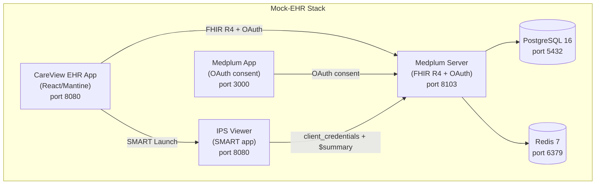

# Mock-EHR Design Document

**RHAIENG-6449** | **Date:** 2026-07-31 | **Status:** Implemented

## Purpose

A mock Electronic Health Record (EHR) that serves as the host environment for the acp-writer SMART on FHIR app. The mock-EHR provides a demo-quality clinical experience that feels authentic — a clinician should look at it and recognize it as "an EHR."

The demo story:

> A clinician opens their hospital's EHR, searches for a patient, reviews their chart (conditions, medications, vitals), clicks "Generate Care Plan," and the acp-writer SMART app launches inside the EHR. The clinician reviews the AI-generated care plan, approves it, and returns to see it in the patient's chart.

## Architecture

### Platform: Medplum Server + Custom Lean App

The mock-EHR uses:
- **Medplum server** as the FHIR R4 backend (replaces HAPI FHIR) — provides FHIR, OAuth, SMART App Launch 2.0.0, and IPS `$summary` in one package
- **Custom lean React app** (`mock-EHR/ui/`) built from `@medplum/react` components — ~20 source files, every line is ours
- **Medplum app** (`medplum/medplum-app`) — stock Medplum admin UI required for the OAuth consent screen
- **IPS Viewer** (`mock-EHR/ips-viewer/`) — standalone SMART app that fetches and displays the International Patient Summary; stands in for the acp-writer until that UI is built

Why not fork medplum-provider: it's 265 files with integrations we don't need (DoseSpot, ScriptSure, billing, fax, AI chat). The clinical UI lives in the `@medplum/react` component library, not in the provider app. Building from components gives us full control with zero fork maintenance.

### Deployment Stack



### Container Images

| Container | Image | Port | Notes |
|---|---|---|---|
| PostgreSQL | `postgres:16` | 5432 | Medplum data store. Uses PVC on OpenShift. |
| Redis | `redis:7` | 6379 | Medplum cache/queue. No persistence needed — RDB disabled. |
| Medplum Server | `medplum/medplum-server:5.1.27` | 8103 | FHIR R4 + OAuth + SMART. Requires `medplum.config.json` (env vars alone don't work). |
| Medplum App | `medplum/medplum-app:5.1.27` | 3000 | Required for OAuth consent screen. Not the EHR UI. |
| CareView EHR App | Custom (our lean app) | 8080 | `nginxinc/nginx-unprivileged:alpine`. Non-root for OpenShift. |
| IPS Viewer | Custom (SMART app) | 8080 | `nginxinc/nginx-unprivileged:alpine`. Non-root for OpenShift. |
| Medplum Loader | Custom (data loading Job) | — | `ubi9/python-312`. Runs as Helm post-install hook. |

## What Was Built

### Mock-EHR App (`mock-EHR/ui/`)

```
src/
├── main.tsx                    # MedplumClient + providers (runtime config via /config.json)
├── App.tsx                     # AppShell + routes + Suspense + isLoading() gate
├── config.ts                   # Configurable branding + async config loader
├── hooks/
│   └── usePatient.ts           # Centralized patient hook with error propagation
├── pages/
│   ├── SignInPage.tsx           # Medplum SignInForm
│   ├── PatientListPage.tsx     # SearchControl with onAuxClick for middle-click
│   ├── PatientChartPage.tsx    # Sidebar (PatientSummary) + LinkTabs + Outlet
│   ├── TimelineTab.tsx         # Medplum PatientTimeline (activity feed, not visit history)
│   ├── MedicationsTab.tsx      # SearchControl for MedicationRequest
│   ├── LabsTab.tsx             # Master-detail: DiagnosticReport list + DiagnosticReportDisplay
│   ├── ObservationsTab.tsx     # SearchControl with custom value/date columns for vitals
│   ├── AllergiesTab.tsx        # SearchControl for AllergyIntolerance
│   ├── CarePlansTab.tsx        # SearchControl for CarePlan
│   ├── EncountersTab.tsx       # SearchControl for Encounter
│   └── StubPage.tsx            # Generic stub for Schedule/Messages/Tasks
└── components/
    ├── SmartLaunchButton.tsx   # Finds ClientApplication by name, uses SmartAppLaunchLink
    ├── VitalsSectionCustom.tsx # Custom sidebar section: combined BP, dates, short labels
    └── ObservationValue.tsx    # Shared helper: formats valueQuantity + component observations
```

Key patterns applied from medplum-provider analysis:
- `isLoading()` gate prevents sign-in page flash on initial load
- `usePatient` hook centralizes patient fetching with `OperationOutcomeAlert` for 404s
- `Suspense` wrapper for graceful loading states
- `onAuxClick` for middle-click/new-tab support
- `?.catch(console.error)` on all `navigate()` calls

### IPS Viewer (`mock-EHR/ips-viewer/`)

A minimal SMART on FHIR app that proves the launch flow works end-to-end. It receives the SMART EHR launch, resolves the patient context, fetches `Patient/$summary`, and displays the IPS sections.

```
src/
├── main.tsx            # React Router setup
├── LaunchPage.tsx      # Reads smart-config.json, gets token via client_credentials,
│                       # resolves SmartAppLaunch resource for patient ID
└── IPSViewerPage.tsx   # Fetches $summary, renders demographics, conditions, meds,
                        # allergies, vitals (combined BP), labs with dates
```

The IPS Viewer uses `client_credentials` instead of interactive OAuth to avoid a double-login problem in dev (the EHR and OAuth consent page are on different origins, so session cookies aren't shared). The `SmartAppLaunch` resource carries the patient context — the viewer resolves it server-side.

### Data Loading (`mock-EHR/deploy/load-medplum.sh`)

Environment-agnostic bash script that bootstraps a complete Medplum instance:

1. Waits for Medplum server health
2. Creates a "CareView EHR" project via `/auth/newuser` + `/auth/newproject` flow
3. Loads hand-crafted FHIR transaction bundles from `$DATA_DIR/*.json`
4. Refreshes auth token, then loads Synthea bundles from `$DATA_DIR/synthea/*.json`
5. Creates practitioner users (Dr. Sarah Mitchell, Dr. James Park)
6. Registers the IPS Viewer (or future acp-writer) as a SMART `ClientApplication` with `launchUri` and `redirectUri`
7. Writes `smart-config.json` with client ID/secret for the IPS Viewer

Token refresh between hand-crafted and Synthea loading prevents expiry on long runs. Curl timeout is 600s per bundle for slower hardware. Takes `MEDPLUM_BASE_URL`, `DATA_DIR`, `ACP_WRITER_LAUNCH_URI`, `ACP_WRITER_REDIRECT_URI`, and `SMART_CONFIG_DIR` as environment variables.

### Patient Data

8 patients total: 3 hand-crafted + 5 Synthea-generated.

#### Hand-crafted patients (`mock-EHR/data/`)

| Bundle | Patient | Resources | Scenario |
|---|---|---|---|
| `patient-bundle-medication.json` | James Reynolds, 55M | Patient, 2 Conditions, 1 MedicationRequest, 1 Observation | HTN + T2DM, on Metformin. Multi-CPG demo. |
| `patient-bundle-lifestyle.json` | Maria Chen, 45F | Patient, 1 Condition, 1 Observation | HTN only, no meds. Lifestyle-only path. |
| `patient-bundle-comprehensive.json` | Robert Thompson, 68M | Patient, 2 Encounters, 3 Conditions, 3 MedicationRequests, 2 AllergyIntolerances, 7 Observations, 2 DiagnosticReports, 1 CarePlan | HTN + T2DM + CKD. Exercises all UI tabs. |

#### Synthea-generated patients (`mock-EHR/data/synthea/`)

Generated with [Synthea](https://github.com/synthetichealth/synthea) (Java 21, seed-based for reproducibility). Each bundle includes full clinical data: encounters, conditions, observations, medications, procedures, immunizations, diagnostic reports, care plans, claims.

| Patient | Age/Gender | Resources | Size | Key conditions |
|---|---|---|---|---|
| Pat3 Terry | 43M | 185 | 592K | Prediabetes, anemia, obesity |
| Eloy Conn | 48M | 120 | 418K | General adult health |
| Delois Mills | 62F | 145 | 469K | General adult health |
| Orlando Kautzer | 51M | 208 | 637K | General adult health |
| Duane Marks | 66M | 216 | 683K | General adult health |

Bundles must stay under ~1MB for reliable loading into Medplum (larger bundles hit request body size limits). Generated with `--exporter.years_of_history=1-2` to keep sizes manageable. To generate more: install Java 17+, download `synthea-with-dependencies.jar`, run with a seed and age/history filters.

#### Data format notes

- `MedicationRequest` (not MedicationStatement) with `intent: "order"`, `authoredOn`, `reasonReference`, `dosageInstruction`
- Patient resources include address, telecom, maritalStatus, typed MRN identifier
- Conditions include `recordedDate`
- Observations include `issued`
- DiagnosticReports include `category: LAB` (required by Medplum's LabsSection client-side filter)
- Hand-crafted bundles use `POST` with `urn:uuid:` internal references (Medplum doesn't support `PUT` with client-specified IDs)
- Synthea bundles use `POST` natively and include `urn:uuid:` references for all internal cross-resource links

## Lessons Learned

### Medplum Compatibility (vs HAPI FHIR)

| Issue | Resolution |
|---|---|
| Medplum requires `POST` for resource creation; `PUT` with client-specified IDs returns 404 | Changed bundles from `PUT` to `POST` with `urn:uuid:` cross-references |
| `MedicationStatement` doesn't appear in IPS `$summary` Medications section | Switched to `MedicationRequest` |
| LabsSection filters `DiagnosticReport` client-side by `category` code `LAB` | Added `category: [{"coding": [{"code": "LAB"}]}]` to DiagnosticReports |
| Built-in `VitalsSection` shows BP as separate sys/dia without dates | Created custom `VitalsSectionCustom` with combined BP display and dates |
| `PatientTimeline` intentionally excludes Encounters | Encounters are containers, not events. Activity tab for communications/reports; Visits tab for encounters. |
| Observation values (including component-based like BP) don't display in `SearchControl` | Created custom `additionalColumns` with `ObservationValue.tsx` helper |
| Labs tab: `DiagnosticReport` values are in referenced Observations, not on the report | Used master-detail pattern with `DiagnosticReportDisplay` (built-in Medplum component) |

### OpenShift Deployment

| Issue | Resolution |
|---|---|
| Docker Hub rate limits block image pulls from the cluster | Pull amd64 images locally with `podman pull --platform linux/amd64`, push to internal OpenShift registry via the external registry route |
| Apple Silicon (arm64) images cached on cluster nodes | Set `imagePullPolicy: Always` on all public image deployments |
| `nginx:alpine` runs as root | Switched to `nginxinc/nginx-unprivileged:alpine`, listen on port 8080 |
| `postgres:16` fails with `lost+found` on PVC mount | Set `PGDATA=/var/lib/postgresql/data/pgdata` |
| Redis RDB snapshot fails without writable volume | Disabled RDB persistence: `--save "" --stop-writes-on-bgsave-error no` |
| Medplum server `command: ["env"]` fails on amd64 image | Server requires `medplum.config.json` file, not just env vars. Created ConfigMap with volume mount at `/usr/src/medplum/medplum.config.json` |
| `MEDPLUM_BASE_URL` baked into app build at `localhost:8103` | Added runtime config: app fetches `/config.json` at startup. On OpenShift, ConfigMap provides Route URL. |
| OAuth consent redirects to wrong port | `MEDPLUM_APP_BASE_URL` must point to the medplum-app Route, not the EHR app |
| SMART launch URI hardcoded to `localhost:3001` | Loader Job passes `ACP_WRITER_LAUNCH_URI` / `ACP_WRITER_REDIRECT_URI` env vars with Route URLs |
| IPS Viewer `smart-config.json` not available on OpenShift | ConfigMap with `ipsViewer.smartClientId` / `smartClientSecret` Helm values, mounted into nginx html |

### Token Management

| Context | Auth Method | Details |
|---|---|---|
| Load script (bash) | `/auth/newuser` + `/auth/newproject` → `authorization_code` | Project creation uses a two-step registration flow, not super admin API. Token is used within the same process. |
| Mock-EHR UI (React) | `MedplumClient` | Built-in auto-refresh with 5-minute grace period. Requires `offline_access` scope for refresh tokens. |
| IPS Viewer | `client_credentials` | Bypasses interactive OAuth to avoid double-login in dev (different origins = separate sessions). |
| acp-writer backend | `client_credentials` (planned) | Use `FHIR_CLIENT_ID` / `FHIR_CLIENT_SECRET` from load script. Token caching with expiry-based refresh. |

## Helm Chart

Custom templates in `mock-EHR/deploy/chart/` (not using Medplum's community Helm chart — follows project conventions instead):

| Template | Resource |
|---|---|
| `postgres-deployment.yaml` | PostgreSQL with PGDATA subdirectory |
| `postgres-service.yaml` | ClusterIP |
| `postgres-pvc.yaml` | gp3-csi, 5Gi |
| `redis-deployment.yaml` | Redis with RDB persistence disabled |
| `redis-service.yaml` | ClusterIP |
| `medplum-server-deployment.yaml` | Medplum server with ConfigMap volume |
| `medplum-server-service.yaml` | ClusterIP |
| `medplum-server-route.yaml` | Edge TLS (browser-accessible for OAuth) |
| `medplum-server-configmap.yaml` | `medplum.config.json` with Route URLs |
| `medplum-app-deployment.yaml` | Medplum admin app (OAuth consent) |
| `medplum-app-service.yaml` | ClusterIP |
| `medplum-app-route.yaml` | Edge TLS (OAuth redirect target) |
| `mock-ehr-app-deployment.yaml` | CareView EHR with config volume |
| `mock-ehr-app-service.yaml` | ClusterIP |
| `mock-ehr-app-route.yaml` | Edge TLS (clinician-facing) |
| `mock-ehr-app-configmap.yaml` | Runtime `config.json` with Medplum Route URL |
| `ips-viewer-deployment.yaml` | IPS Viewer with smart-config volume |
| `ips-viewer-service.yaml` | ClusterIP |
| `ips-viewer-route.yaml` | Edge TLS (SMART launch target) |
| `ips-viewer-configmap.yaml` | `smart-config.json` with client credentials |
| `loader-job.yaml` | Helm post-install hook with Route-based URIs |

Deploy: `helm upgrade --install cpg-mock-ehr ./mock-EHR/deploy/chart --namespace sschifma-cpg-to-acp`

For the IPS Viewer credentials (which are generated at load time): `--set ipsViewer.smartClientId=... --set ipsViewer.smartClientSecret=...`

## Decisions

1. **Medplum version pinning**: All `@medplum/*` packages and Docker images pinned to **`5.1.27`**. Medplum patches include features (not just bug fixes) and Alpha features may break. Review for upgrade every 2-3 months. Do not skip minor versions (5.1 → 5.2, not 5.1 → 5.3).

2. **Patient data strategy**: Hybrid approach. 3 hand-crafted patients for primary demo scenarios (predictable DMN paths) + 5 Synthea-generated patients for background data richness. Total: 8 patients. Synthea bundles kept under ~1MB to avoid Medplum body size limits.

3. **EHR name**: "CareView EHR" — defined in `config.ts`, flows to `AppShell` header and sign-in page. Keep configurable; marketing may change it.

4. **Data loading**: Fully automated. `load-medplum.sh` is environment-agnostic (takes `MEDPLUM_BASE_URL`). Runs as podman-compose service locally, Kubernetes Job on OpenShift.

5. **Activity tab**: Uses Medplum's standard `PatientTimeline` (communications, reports, tasks — not encounters). Encounters belong in the Visits tab. Tab labeled "Activity" to clarify its purpose.

## Remaining Work

- **Enrich Reynolds/Chen**: Add encounters, allergies, more observations to match Thompson's data quality (low priority — Synthea patients provide data richness)
- **CSS modules**: Extract inline styles to CSS modules for dark mode and responsive support (low priority)
- **acp-writer integration**: When the real acp-writer UI is built, register it as the SMART app in place of the IPS Viewer
- **Load script idempotency**: The load script fails on re-run because the project/users already exist. Consider adding upsert logic or a "skip if exists" check.
