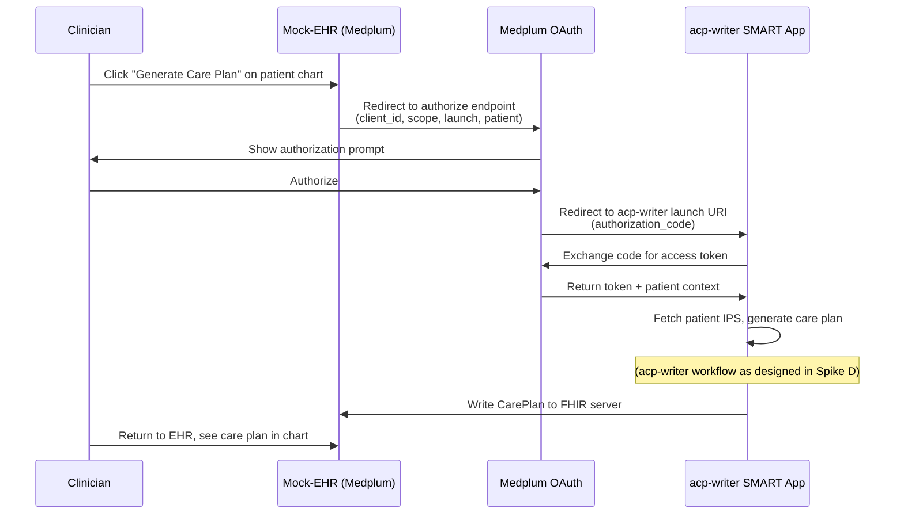
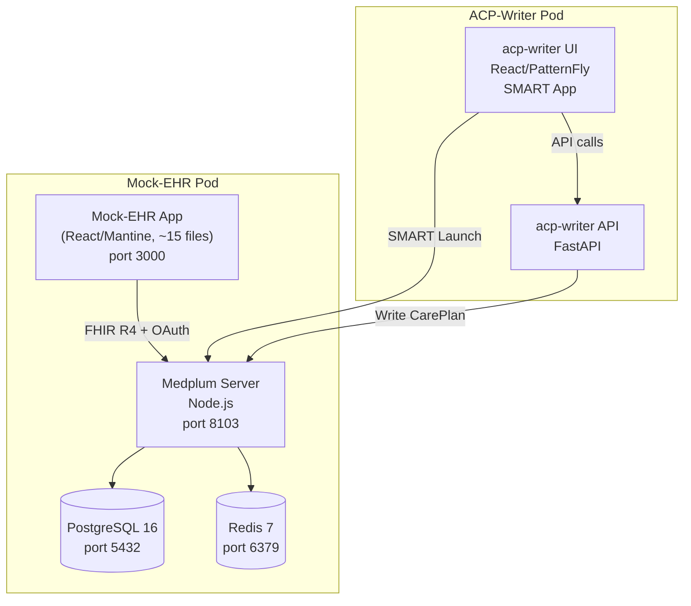

# Mock-EHR Design Document

**RHAIENG-6449** | **Date:** 2026-07-30 | **Status:** Draft

## Purpose

Design a mock Electronic Health Record (EHR) that serves as the host environment for the acp-writer SMART on FHIR app. The mock-EHR's purpose is to provide a demo-quality clinical experience that feels authentic — a clinician should look at it and recognize it as "an EHR." It is not a real EHR and does not need to be fully functional.

The key demo story:

> A clinician opens their hospital's EHR, searches for a patient, reviews their chart (conditions, medications, vitals), clicks "Generate Care Plan," and the acp-writer SMART app launches inside the EHR. The clinician reviews the AI-generated care plan, approves it, and returns to see it in the patient's chart.

## Decision: Medplum Server + Custom Lean App

After research (documented in `ehr-research-notes.md` and `dev_docs/ui/spike-e-mock-ehr.md`), the recommendation is:

- **Medplum server** as the FHIR backend (replaces HAPI FHIR)
- **Custom lean React app** built from `@medplum/react` components (NOT a fork of medplum-provider)
- **Medplum's built-in SMART on FHIR** for launching the acp-writer

### Why Medplum Server

1. **FHIR R4 + SMART + OAuth in one package**: Medplum provides a FHIR server, OAuth authorization server, and SMART App Launch 2.0.0 out of the box. No Keycloak needed for the demo.

2. **IPS support**: Medplum supports the `Patient/$summary` operation for generating International Patient Summary (IPS) documents. The acp-writer can call `GET /fhir/R4/Patient/{id}/$summary` to get a complete IPS Bundle. Caveat: omits empty sections rather than including "no known" entries, and hasn't been formally IPS-certified. Fine for our purposes.

3. **FHIR R4 compatible**: Same FHIR bundles, same patient data — just point to Medplum's FHIR endpoint instead of HAPI's.

4. **OpenShift deployable**: Four containers (PostgreSQL, Redis, medplum-server, medplum-app), all standard OCI images. No AWS-specific dependencies in the Docker deployment path. Helm chart available at `charts.medplum.com`.

### Why a Custom App (Not a Fork)

The `medplum-provider` example app is 265 source files with deep integrations we don't need (DoseSpot e-prescribing, ScriptSure, Health Gorilla lab ordering, billing/claims, fax, AI chat). Forking it means inheriting and maintaining code that has nothing to do with our demo.

The key insight is that **the clinical UI lives in the `@medplum/react` component library, not in the provider app**. The provider app's pages are thin wrappers — `TimelineTab.tsx` is 15 lines, and most tabs are just a `SearchControl` component with a FHIR query. We can build the same experience in ~15 files and ~400 lines of our own code.

| Approach | Files | Maintenance | Control |
|---|---|---|---|
| Fork medplum-provider | ~265 (strip to ~100) | Track upstream, resolve merge conflicts | Modify existing code |
| Custom app from components | ~15 (all ours) | `npm update @medplum/react` | Full control, own every line |

### What Changes from Current Architecture

| Before | After |
|---|---|
| HAPI FHIR server | Medplum server (FHIR R4 + SMART + OAuth) |
| Python MCP client as "EHR" | Custom React/Mantine app using `@medplum/react` |
| No SMART on FHIR | Built-in SMART App Launch |
| No clinical EHR UI | Clinical EHR experience |

The acp-writer backend is unchanged — it just writes CarePlans to Medplum's FHIR endpoint instead of HAPI's. The cpg-ingester delivery works the same way.

## EHR Design: What to Build

### Approach

Build a new Vite + React + TypeScript project in `mock-EHR/ui/` that uses `@medplum/react` and `@mantine/core` as npm dependencies. The Medplum components handle all FHIR data fetching and display — our code is routing, layout, and the SMART launch button.

### Project Structure

```
mock-EHR/ui/
├── src/
│   ├── main.tsx                    # Entry point, MedplumProvider + MantineProvider
│   ├── App.tsx                     # Router + AppShell layout
│   ├── config.ts                   # Medplum server URL, SMART app config
│   ├── pages/
│   │   ├── PatientListPage.tsx     # SearchControl for Patient
│   │   ├── PatientChartPage.tsx    # Chart layout: banner + sidebar + tabs + outlet
│   │   ├── TimelineTab.tsx         # PatientTimeline
│   │   ├── MedicationsTab.tsx      # SearchControl for MedicationRequest
│   │   ├── LabsTab.tsx             # SearchControl for DiagnosticReport/Observation
│   │   ├── CarePlansTab.tsx        # SearchControl for CarePlan
│   │   ├── EncountersTab.tsx       # SearchControl for Encounter
│   │   ├── AllergiesTab.tsx        # SearchControl for AllergyIntolerance
│   │   └── SignInPage.tsx          # Medplum SignInForm
│   └── components/
│       └── SmartLaunchButton.tsx   # "Generate Care Plan" button using SmartAppLaunchLink
├── index.html
├── package.json
├── vite.config.ts
├── tsconfig.json
└── Dockerfile                      # Multi-stage: node build → nginx serve
```

**~15 source files. Every line is ours.**

### Dependencies

```json
{
  "dependencies": {
    "@medplum/core": "5.1.27",
    "@medplum/fhirtypes": "5.1.27",
    "@medplum/react": "5.1.27",
    "@medplum/react-hooks": "5.1.27",
    "@mantine/core": "^8.3.0",
    "@mantine/hooks": "^8.3.0",
    "@mantine/notifications": "^8.3.0",
    "@tabler/icons-react": "^3.x",
    "react": "^19.x",
    "react-dom": "^19.x",
    "react-router": "^7.x"
  }
}
```

Pin `@medplum/*` packages to exact version `5.1.27` (see Decisions). Use the same version for the `medplum/medplum-server` Docker image tag.

### Screens and Navigation

#### Global Navigation (Left Sidebar)

The `AppShell` component from `@medplum/react` provides the application shell with sidebar, header, and spotlight search. We configure the sidebar with four nav items that match real EHR patterns:

| Nav Item | Route | Component |
|---|---|---|
| Patients | `/Patient` | `PatientListPage` |
| Schedule | `/Schedule` | Placeholder or `Scheduler` component |
| Messages | `/Communication` | Placeholder using `SearchControl` |
| Tasks | `/Task` | Placeholder using `SearchControl` |

For the initial demo, only "Patients" needs to be fully functional. Schedule, Messages, and Tasks can be stub pages that show the nav item exists (demonstrating EHR-like navigation) with a simple `SearchControl` that lists the relevant resources.

#### Patient List (Landing Page)

The patient list is the first screen a clinician sees after sign-in.

```
┌──────────────────────────────────────────────────────────────┐
│  🏥 CareView EHR                        Dr. Sarah Mitchell ▾│
├──────────┬───────────────────────────────────────────────────┤
│          │  My Patients                    [Search patients] │
│ Patients │                                                   │
│ ──────── │  ┌────────────────────────────────────────────┐   │
│ Schedule │  │ Name          │ MRN  │ DOB       │ Gender │   │
│ ──────── │  ├───────────────┼──────┼───────────┼────────┤   │
│ Messages │  │ Reynolds, J   │ P001 │ 1971-03-15│ Male   │   │
│ ──────── │  │ Chen, Maria   │ P002 │ 1981-06-22│ Female │   │
│ Tasks    │  │ Thompson, R   │ P003 │ 1958-11-30│ Male   │   │
│          │  │ ...           │      │           │        │   │
│          │  └────────────────────────────────────────────┘   │
│          │                                                   │
└──────────┴───────────────────────────────────────────────────┘
```

Implementation: `SearchControl` with `resourceType: 'Patient'` and configured columns for name, identifier (MRN), birthDate, gender. Medplum's `SearchControl` provides built-in search, column sorting, filtering, and pagination.

Estimated code: **~30 lines**.

#### Patient Chart

When a clinician clicks a patient, they see the patient chart. This is the core screen.

```
┌──────────────────────────────────────────────────────────────────┐
│  🏥 CareView EHR                           Dr. Sarah Mitchell ▾ │
├──────────┬───────────────────────────────────────────────────────┤
│          │ ┌─────────────────────────────────────────────────┐   │
│ Patients │ │ Reynolds, James  MRN: P001  DOB: 03/15/1971    │   │
│ ──────── │ │ 55yo Male  Allergies: NKDA                     │   │
│ Schedule │ └─────────────────────────────────────────────────┘   │
│ ──────── │                                                       │
│ Messages │ [Timeline] [Visits] [Meds] [Labs] [Allergies]         │
│ ──────── │ [Care Plans]                                          │
│ Tasks    │ ─────────────────────────────────────────────────────  │
│          │                                                       │
│          │ ┌─ Patient Summary ──────┐  ┌─ Tab Content ───────┐  │
│          │ │                        │  │                      │  │
│          │ │ Problems               │  │ (varies by tab)      │  │
│          │ │ • Essential HTN        │  │                      │  │
│          │ │ • Type 2 DM            │  │                      │  │
│          │ │                        │  │                      │  │
│          │ │ Medications            │  │                      │  │
│          │ │ • Metformin 500mg BID  │  │                      │  │
│          │ │                        │  │                      │  │
│          │ │ Allergies              │  │                      │  │
│          │ │ • NKDA                 │  │                      │  │
│          │ │                        │  │                      │  │
│          │ │ Vitals (Latest)        │  │                      │  │
│          │ │ BP: 142/92 mmHg       │  │                      │  │
│          │ │                        │  │                      │  │
│          │ │ [Generate Care Plan]   │  │                      │  │
│          │ └────────────────────────┘  └──────────────────────┘  │
│          │                                                       │
└──────────┴───────────────────────────────────────────────────────┘
```

The layout uses:
- **Patient banner** (`PatientHeader`): Persistent strip at top of chart with name, MRN, DOB, age, gender, allergies
- **Sidebar** (`PatientSummary`): Scrollable summary with configurable sections — we include `ProblemListSection`, `MedicationsSection`, `AllergiesSection`, `VitalsSection`, `LabsSection`
- **Tabs** (`LinkTabs`): Chart navigation across clinical categories
- **Content area** (React Router `<Outlet />`): Renders the active tab's content

The **"Generate Care Plan"** button sits at the bottom of the `PatientSummary` sidebar. It uses Medplum's `SmartAppLaunchLink` component to initiate the SMART on FHIR launch.

Estimated code: **~80 lines** for the layout page.

#### Patient Chart Tabs

Each tab is a lightweight component — typically under 30 lines — using Medplum's `SearchControl` or a dedicated display component.

| Tab | Component | Lines (est.) | Content |
|---|---|---|---|
| **Timeline** | `PatientTimeline` | ~15 | Chronological event feed |
| **Visits** | `SearchControl` for Encounter | ~30 | Encounter list with date, type, status |
| **Meds** | `SearchControl` for MedicationRequest | ~30 | Active medications with drug, dose, frequency |
| **Labs** | `SearchControl` for DiagnosticReport | ~30 | Lab results with date, test name, status |
| **Allergies** | `SearchControl` for AllergyIntolerance | ~25 | Allergy list with substance, reaction, severity |
| **Care Plans** | `SearchControl` for CarePlan | ~30 | Care plans with status, intent, category |

**Total tab code: ~160 lines.**

### SMART App Launch Flow

When the clinician clicks "Generate Care Plan":



We register the acp-writer as a `ClientApplication` in Medplum with:
- `launchUri`: the acp-writer's entry point URL
- `redirectUri`: the acp-writer's OAuth callback URL
- Required scopes: `patient/*.read` (to fetch patient data), `patient/CarePlan.write` (to write care plans)

The `SmartAppLaunchLink` component from `@medplum/react` wraps the launch URL construction. Our `SmartLaunchButton.tsx` component renders it as a prominent button in the patient summary sidebar.

### Care Plan Display in EHR

After the acp-writer writes a CarePlan to the FHIR server, it appears in the patient's **Care Plans** tab. The `SearchControl` component with `resourceType: 'CarePlan'` displays it automatically with columns for status, category, and dates.

Clicking a care plan navigates to the Medplum resource detail view (using a generic `ResourcePage` route) which renders the full CarePlan — goals, activities, and references.

### Visual Design

#### Color Palette

Clinical systems universally use:
- **Primary**: Blue (trust, clinical authority) — Mantine's default blue theme works
- **Background**: White + light gray
- **Alerts**: Red (critical/allergies), yellow (warnings), green (normal)
- **Text**: Dark gray/near-black for readability

Mantine theming via `MantineProvider` lets us configure the color scheme in one place.

#### Information Density

EHRs prioritize information density over whitespace:
- `PatientSummary` sidebar: compact clinical sections
- `SearchControl` tables: dense rows with aligned columns
- Timestamps on all clinical data
- SNOMED/ICD codes alongside display names (Medplum components show these by default)

#### Patient Banner

The `PatientHeader` component shows:
- **Name** (Last, First) — bold, prominent
- **MRN** — clearly labeled
- **DOB** and calculated **age**
- **Gender**
- **Allergy indicator** — "NKDA" or red-highlighted allergy names

#### Branding

The mock-EHR has its own fictional brand identity:
- **Name**: "CareView EHR" (or similar generic clinical name)
- **Logo**: A healthcare icon from `@tabler/icons-react` (e.g., `IconStethoscope`)
- Must NOT use Red Hat branding, PatternFly, or any indication it's the same product as the acp-writer
- The visual contrast between the Mantine-styled EHR and the PatternFly-styled acp-writer is intentional and important for the demo

> **Design note — keep branding configurable.** The app name, logo icon, and primary color are defined in `config.ts` and consumed by `App.tsx`. Marketing will likely have opinions on the name — never hardcode it in component files. All branding should flow from configuration.

### Patient Data Strategy

**Target: 8+ patients** with varied clinical scenarios. Two approaches, used together:

#### Approach 1: Hand-Crafted Primary Demo Patients (keep existing)

The 2 existing patients (Reynolds, Chen) are hand-crafted for specific DMN decision paths. These stay because they're designed to exercise specific acp-writer scenarios with predictable outcomes:

| Patient | Scenario | Source |
|---|---|---|
| James Reynolds, 55M | HTN + T2DM, on Metformin | Hand-crafted (existing) |
| Maria Chen, 45F | HTN only, no meds | Hand-crafted (existing) |

#### Approach 2: Synthea for Background Patients

[Synthea](https://github.com/synthetichealth/synthea) is an open-source synthetic patient generator from MITRE (Apache 2.0) that produces clinically realistic FHIR R4 transaction bundles. It models complete patient life trajectories with proper coding (SNOMED, ICD-10, RxNorm, LOINC) and realistic lab values, vital signs, medication progressions, and encounter histories.

Key findings:
- **All our target conditions have dedicated modules**: hypertension, type 2 diabetes (via metabolic syndrome), CKD, CHF
- **Output**: FHIR R4 transaction bundles — directly POSTable to Medplum (Medplum confirms compatibility)
- **25 FHIR resource types** generated including Patient, Condition, MedicationRequest, Observation, AllergyIntolerance, Encounter, Procedure, Immunization, CarePlan, DiagnosticReport
- **Controllable**: filter by age (`-a 50-80`), gender (`-g F`), condition (Keep Module with SNOMED codes), history length (`exporter.years_of_history`)
- **Reproducible**: seed flag (`-s 12345`) produces identical output
- **Requires**: Java 17+ (CLI tool, no official Docker image for Java version)

**Recommended workflow**: Create a `mock-EHR/scripts/generate-patients.sh` script that:

1. Runs Synthea with Keep Module filters for target conditions
2. Sets `exporter.years_of_history=5` to keep bundles manageable (~200KB-2MB per patient vs. current 4-7KB hand-crafted bundles)
3. Generates a pool of candidates, selects 6-8 with good clinical variety
4. Copies selected bundles to `mock-EHR/data/synthea/`

The load script then posts bundles in order: hospitals → practitioners → patients (Synthea bundles use query references to practitioners/organizations that must exist first).

**Target patient roster:**

| # | Scenario | Source | Purpose |
|---|---|---|---|
| 1 | HTN + T2DM, on Metformin | Hand-crafted | Primary demo: multi-CPG |
| 2 | HTN only, no meds | Hand-crafted | Lifestyle-only path |
| 3 | HTN + T2DM + CKD | Synthea (keep module) | Complex: contraindications |
| 4 | HTN + CHF | Synthea (keep module) | Complex: fluid management |
| 5 | Pre-HTN, younger adult | Synthea (-a 30-45) | Borderline case |
| 6-8 | Various chronic conditions | Synthea (general) | Background for patient list |

#### Why Both Approaches

- **Hand-crafted patients** give us precise control over the primary demo scenarios where we need predictable DMN paths
- **Synthea patients** give us clinically rich background data (full encounter histories, realistic lab trends, proper coding) that makes the EHR feel real — without spending days hand-authoring FHIR bundles
- **Easy to add more**: run the generate script again with different seeds or filters

The existing FHIR transaction bundles and Synthea bundles both load directly into Medplum — it accepts standard FHIR R4 bundles via `POST /fhir/R4`.

## Architecture

### Deployment Stack



### Container Images

| Container | Image | Port | Notes |
|---|---|---|---|
| PostgreSQL | `postgres:16` | 5432 | Medplum data store |
| Redis | `redis:7` | 6379 | Medplum cache/queue |
| Medplum Server | `medplum/medplum-server:5.1.27` | 8103 | FHIR R4 + OAuth + SMART server |
| Mock-EHR App | Custom (our lean app, nginx) | 3000 | ~15 source files, Vite build → nginx |

### Data Loading

Patient data loading follows the same pattern as our current HAPI FHIR setup:
1. Wait for Medplum server to be healthy
2. Create a Medplum project (via super admin registration endpoint)
3. POST FHIR transaction bundles to `{server}/fhir/R4`
4. Register the acp-writer as a `ClientApplication` (SMART app)
5. Create practitioner users and link to Practitioner resources

This can be an init container or a startup script, adapting the existing `mock-EHR/deploy/load-data.sh`.

### OpenShift Deployment

- PostgreSQL: OpenShift PostgreSQL template or Crunchy Postgres operator
- Redis: OpenShift Redis template
- Medplum Server: Standard Deployment + Service + Route
- Mock-EHR App: Standard Deployment + Service + Route (nginx serving static SPA)
- Configure `MEDPLUM_BASE_URL` and `MEDPLUM_APP_BASE_URL` to use OpenShift Route URLs
- Ensure containers run as non-root (OpenShift security requirement)
- Helm chart available from Medplum (`charts.medplum.com`) as a starting point

## Identity Management and Access Control

### Medplum's Built-in Auth

Medplum has its own FHIR-native identity and access control system:

- **Users**: The `User` resource represents digital identity. Users can be server-scoped (admins/developers across projects) or project-scoped (clinicians/patients in a single project).
- **Projects**: Multi-tenancy via projects — each project has its own users, data, and access policies.
- **Access Policies**: The `AccessPolicy` resource provides fine-grained, per-resource-type and per-field access control. Each user or client application can be assigned an access policy.
- **Multi-tenant**: Data can be partitioned by Organization, HealthcareService, or CareTeam using FHIR compartments.

For our demo, this means we can:
- Create multiple practitioner users with different logins
- Assign access policies to restrict what each user can see
- The clinician's identity flows through the SMART launch to the acp-writer

### External Identity Providers (including Keycloak)

Medplum supports external identity providers via standard OAuth2/OIDC:
- **Documented integrations**: Auth0, AWS Cognito, Okta, Google
- **Token exchange**: Exchange an external access token for a Medplum token (OAuth 2.0 Token Exchange standard)
- **Direct external auth**: Present a JWT from an external IdP and Medplum validates it (requires self-hosted, super admin config)
- **Domain-level IdP**: Configure a provider for an email domain — all users on that domain authenticate via the external IdP

**Keycloak integration**: No Keycloak-specific documentation, but Keycloak can be used via the same OAuth2/OIDC mechanisms as Auth0/Okta. For the demo, Medplum's built-in auth is sufficient. Keycloak integration is available if needed for the OpenShift deployment (where Keycloak/RHSSO is commonly used).

### Demo User Setup

| User | Role | Purpose |
|---|---|---|
| Dr. Sarah Mitchell | Physician | Primary demo user — searches patients, launches care plan generation |
| Dr. James Park | Physician | Secondary user — shows multi-user capability |
| Admin | Super Admin | Data loading, SMART app registration |

Each user gets a `Practitioner` resource linked to their `User` resource, and an appropriate `AccessPolicy`.

## Implementation Plan

### Phase 1: Medplum Infrastructure

1. Create `mock-EHR/deploy/compose-medplum.yml` based on Medplum's `docker-compose.full-stack.yml` (adapted for podman-compose)
2. Adapt existing `load-data.sh` to work with Medplum's API (project creation, bundle loading, user setup)
3. Verify existing patient bundles load correctly into Medplum
4. Register acp-writer as a `ClientApplication` (SMART app) in the load script
5. Verify `Patient/$summary` returns a valid IPS Bundle for loaded patients

### Phase 2: Build Mock-EHR App

1. Scaffold Vite + React + TypeScript project in `mock-EHR/ui/`
2. Install `@medplum/react`, `@medplum/core`, `@mantine/core`, `react-router`
3. Build `App.tsx` with `AppShell` layout and sidebar navigation
4. Build `PatientListPage.tsx` with `SearchControl`
5. Build `PatientChartPage.tsx` with `PatientSummary` sidebar + `LinkTabs` + `<Outlet />`
6. Build tab pages: Timeline, Meds, Labs, Allergies, Care Plans, Encounters
7. Build `SmartLaunchButton.tsx` using `SmartAppLaunchLink`
8. Add branding (app name, logo, Mantine theme)
9. Create `Dockerfile` (Vite build → nginx)

### Phase 3: SMART App Integration

1. Configure the acp-writer UI to handle SMART launch (receive patient context from OAuth token)
2. Test end-to-end launch flow: EHR → SMART auth → acp-writer opens with patient
3. Verify care plan written by acp-writer appears in the EHR's Care Plans tab
4. Handle return-to-EHR flow after approval

### Phase 4: Demo Polish

1. Populate 8+ demo patients with clinically realistic data (see Patient Data Strategy)
2. Ensure all patient data is properly coded (SNOMED, ICD-10, RxNorm, LOINC)
3. Add past encounters and observations for timeline richness
4. Test the full demo narrative end-to-end
5. Verify OpenShift deployment

## Code Size Estimate

| File | Lines (est.) | What it does |
|---|---|---|
| `main.tsx` | ~20 | MedplumProvider + MantineProvider + Router |
| `App.tsx` | ~60 | AppShell + route definitions + sidebar config |
| `config.ts` | ~15 | Server URL, SMART app client ID, branding |
| `SignInPage.tsx` | ~15 | Medplum `SignInForm` wrapper |
| `PatientListPage.tsx` | ~30 | `SearchControl` for Patient with column config |
| `PatientChartPage.tsx` | ~80 | Chart layout: banner + sidebar + tabs + outlet |
| `TimelineTab.tsx` | ~15 | `PatientTimeline` wrapper |
| `MedicationsTab.tsx` | ~30 | `SearchControl` for MedicationRequest |
| `LabsTab.tsx` | ~30 | `SearchControl` for DiagnosticReport |
| `AllergiesTab.tsx` | ~25 | `SearchControl` for AllergyIntolerance |
| `CarePlansTab.tsx` | ~30 | `SearchControl` for CarePlan |
| `EncountersTab.tsx` | ~30 | `SearchControl` for Encounter |
| `SmartLaunchButton.tsx` | ~20 | `SmartAppLaunchLink` styled as a button |
| `Dockerfile` | ~15 | Multi-stage build |
| `vite.config.ts` | ~10 | Standard Vite config |
| **Total** | **~425** | |

## Risks and Mitigations

| Risk | Impact | Mitigation |
|---|---|---|
| `@medplum/react` components don't render well without Medplum-specific data patterns | Clinical views look empty or broken | Test with our patient bundles early; Medplum components are designed for standard FHIR R4 |
| Medplum server images don't run as non-root on OpenShift | Blocks OpenShift deployment | Test early; build custom image if needed |
| Medplum FHIR server has subtle compatibility differences from HAPI | Patient data doesn't load | Test with existing bundles in Phase 1 before building UI |
| `@medplum/react` API changes between versions | Components break on update | Pin to specific patch version; upgrades are a deliberate choice (see Decisions) |
| PostgreSQL + Redis adds infrastructure complexity vs. HAPI alone | More containers to manage | Medplum's compose file handles orchestration; OpenShift has operators for both |
| `PatientSummary` sections don't show the data we want | Missing clinical context in sidebar | Sections are configurable — use `getDefaultSections()` and customize; or build a simple custom sidebar using `useSearch` hooks |

## Alternatives Considered

### Fork medplum-provider (rejected)

Fork the 265-file medplum-provider app, strip ~150 files we don't need, customize the rest.

- Fastest path to "something working" but highest maintenance burden
- Inherits DoseSpot, ScriptSure, billing, fax, AI chat code we don't want
- Upstream updates become merge conflicts
- We own 265 files but only authored ~20

Rejected in favor of building a lean app from components.

### SMART-EHR-Launcher + HAPI FHIR (fallback)

If Medplum doesn't work out:
- Keep HAPI FHIR as the server
- Fork SMART-EHR-Launcher (CSIRO) as the EHR UI (React + Tailwind/shadcn)
- Use smart-launcher-v2 (CSIRO fork) as the OAuth proxy

Architecture: `EHR-Launcher (nginx) → smart-launcher-v2 (Node.js OAuth proxy) → HAPI FHIR`

Provides: patient display, 9-tab clinical view, SMART launch, embedded app iframe, runtime `config.json` config.

Lacks vs. Medplum approach: no patient search/list, no scheduling/tasks/messaging, read-only, no CarePlan tab, no IPS `$summary`, looks more like a developer tool than an EHR.

Lower infrastructure complexity (3 containers, no PostgreSQL/Redis) but requires more UI work and less EHR-authentic result.

### Custom PatternFly EHR (rejected)

Ruled out in Spike E. The mock-EHR must NOT use PatternFly — it needs to look like a different product from the acp-writer.

## EHR Authenticity: Key Visual Patterns

Based on research of Epic, Cerner/Oracle Health, and other major EHR systems, the following patterns make a clinical system instantly recognizable as "an EHR." The mock-EHR should incorporate these:

### Must-Have Patterns

1. **Persistent patient context**: A patient banner or sidebar that is always visible when a chart is open. Shows Name (Last, First), MRN, DOB, Age, Gender, Allergies. This is the single most distinguishing feature of an EHR.

2. **Tab-based chart navigation**: Clinical categories as tabs (not a generic menu). Standard order: Timeline, Visits, Meds, Labs, Allergies, Care Plans.

3. **Dense tabular data**: Lab results, medication lists, and vital signs in compact tables with many rows and columns. EHRs prioritize information density over whitespace.

4. **Clinical color conventions**: Red = critical/allergies/abnormal values. Yellow = warnings. Green = normal. Blue = links/actions. Gray = inactive/historical.

5. **Date/time stamps on everything**: Every clinical entry has a date. Temporal orientation is fundamental to EHRs.

6. **Status badges**: Active, Completed, Discontinued with color coding on problems, medications, and care plans.

### Nice-to-Have for Demo Quality

7. **Abnormal value flagging**: Lab values outside normal range in bold red with H/L indicators.

8. **Encounter/visit context**: Visible visit type, date, and provider.

9. **Clinical alert indicators**: Allergy severity, code status as colored badges in the patient banner.

### Anti-Patterns to Avoid

- Too much whitespace (consumer app feel)
- Card-based layouts for clinical data (should be tabular)
- Bright/playful colors (should be subdued clinical palette)
- Missing timestamps
- Generic navigation labels (use clinical terminology)

## Decisions

All open questions resolved:

1. **Medplum version pinning**: Pin all `@medplum/*` npm packages and the `medplum-server` Docker image to exact version **`5.1.27`** (released 2026-07-24). Medplum releases patches every 4-7 days (5.1.0 was Feb 25, 5.1.27 is Jul 24 — 27 patches in 5 months). All 5.1.x releases are non-breaking for GA features, but patches include new features (not just bug fixes) and Alpha-tagged features may break. Pinning to the latest gives us the most bug fixes and the most tested version. Mantine packages pin to `^8.3.0` (the version medplum-provider uses).

   > **Maintenance note — schedule version reviews.** Medplum moves fast (~27 patches in 5 months). Review for upgrade every 2-3 months or when adding new features that might benefit from upstream fixes. Add a note in the project plan to check for Medplum updates at major phase boundaries. Upgrade process: bump the pin in `package.json` and `compose-medplum.yml`, test, commit. Do not skip minor versions when upgrading (e.g., must go 5.1 → 5.2, not 5.1 → 5.3).

2. **Patient data strategy**: 8+ patients using a hybrid approach. Keep the 2 hand-crafted patients for primary demo scenarios (predictable DMN paths). Use Synthea to generate 6+ background patients with clinically realistic data (full encounter histories, proper coding, realistic lab values). Create a `generate-patients.sh` script so adding more patients is trivial. See Patient Data Strategy section for details.

3. **EHR name**: "CareView EHR" for now. The name is defined in a single config constant (`config.ts`) and flows from there into the `AppShell` header and sign-in page. Marketing may want to change it later — keep this configurable by design, never hardcode the name in component files.

4. **Data loading automation**: Fully automated in both environments. The load script handles: wait for server health → create project via super admin endpoint → load patient bundles → create practitioner users → register acp-writer `ClientApplication`. Locally, one `podman-compose up` produces a working demo. On OpenShift, the load script runs as a Kubernetes Job (or init container) that executes after the Medplum server pod is healthy. The script itself is environment-agnostic — it takes the Medplum server URL as a parameter and uses the FHIR REST API. No manual steps in either environment.

5. **Schedule/Messages/Tasks tabs**: Stub pages using `SearchControl` for now. ~15 lines each, functional but not populated with data. Enough to demonstrate EHR-like navigation without authoring extra FHIR resources.
