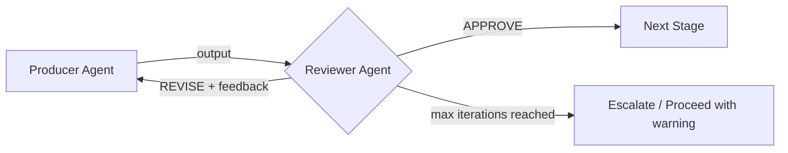
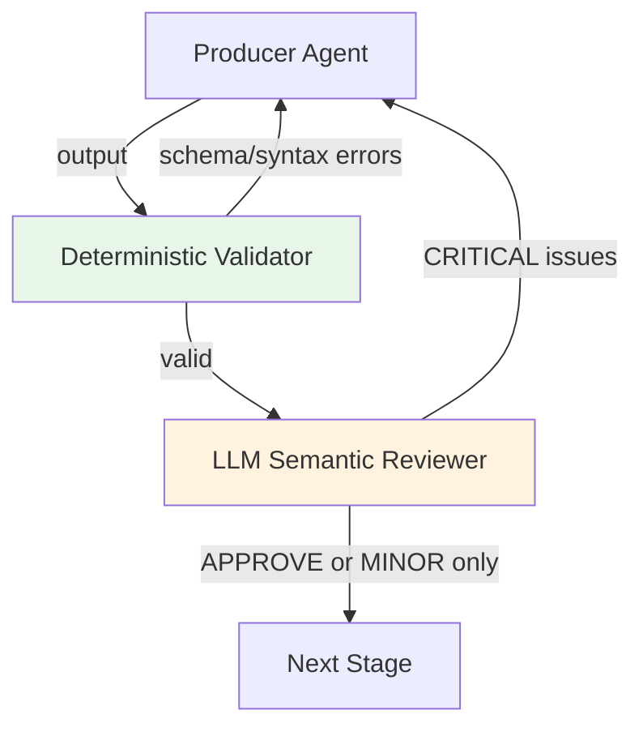
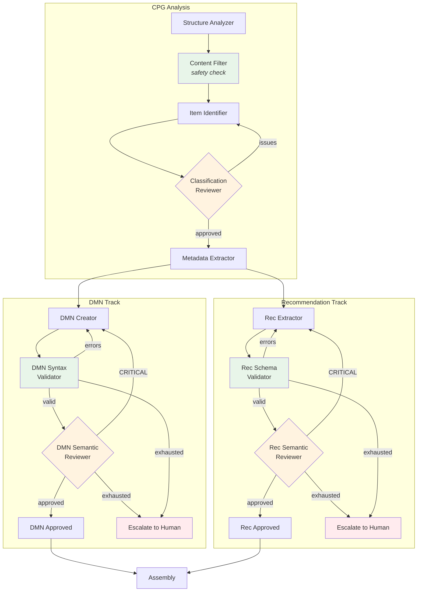
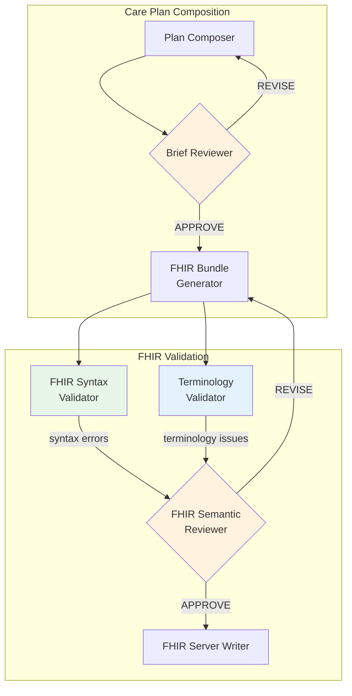
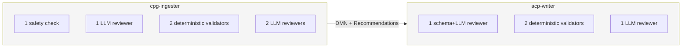

# Adversarial Review Pattern

This document describes the adversarial review architecture used throughout the CPG-to-ACP system. The pattern ensures clinical safety by having independent agents verify each other's work before outputs cross pipeline boundaries.

## The Problem

LLM-generated clinical content — decision tables, recommendations, care plans — can contain plausible-sounding errors: fabricated thresholds, reversed dosing logic, hallucinated drug names. A single-agent architecture has no way to catch these errors before they reach a clinician. The system handles clinical data where a wrong threshold or missing contraindication has real consequences.

## The Pattern

Every substantive LLM output passes through an independent reviewer before proceeding. The reviewer is a separate agent with a different clinical persona, access to the original source material, and explicit instructions to challenge rather than rubber-stamp. This creates a structured disagreement loop:

### Design Principles

1. **Distinct personas.** The reviewer has a different clinical role than the producer. A "clinical pharmacist" reviews the work of a "clinical informaticist." Prompts explicitly state: "You are NOT the analyst who produced this."

2. **Source material access.** Reviewers always see the original CPG text, not just the producer's output. Reviewing output alone misses ~21% of hallucinations (per design analysis research).

3. **Claim-level decomposition.** Rather than asking "is this good?", reviewers decompose outputs into individual verifiable claims and check each one. This is particularly effective for DMN decision tables where each threshold, variable, and rule can be verified independently.

4. **Severity classification.** Issues are classified as CRITICAL (changes clinical behavior) or MINOR (structural preferences). Only CRITICAL issues trigger revision. This prevents infinite loops over stylistic disagreements.

5. **Bounded iteration.** Review loops are capped (2 iterations for cpg-ingester, 4 for acp-writer). Diminishing returns set in quickly, and overcorrection becomes a risk after multiple rounds.

6. **Fail-safe exhaustion.** When the cap is reached without agreement, the system either escalates to human review (cpg-ingester) or proceeds with a warning (acp-writer). Content is never silently passed through.

## Tiered Validation

The system uses a two-tier validation architecture: deterministic checks run first (cheap, fast, unambiguous), and LLM-based semantic review runs only if the deterministic checks pass. This saves tokens and catches structural problems before spending LLM calls on semantic analysis.

## Where It Is Used

The system contains 10 review instances across both pipelines — 4 LLM adversarial reviewers, 4 deterministic validators, 1 deterministic safety check, and 1 external API validator.

### cpg-ingester Pipeline

The cpg-ingester pipeline extracts decision logic (DMN) and clinical recommendations from CPG documents. Six review points protect the extraction process:

| Reviewer | Reviews | Type | Persona | Max Loops | On Exhaustion |
|---|---|---|---|---|---|
| **Content Filter** | Structure Analyzer section classifications | Deterministic | — | 1 (inline) | Auto-corrects |
| **Classification Reviewer** | Item Identifier manifest | LLM | Clinical guideline methodologist | 2 | Proceed with best-effort |
| **DMN Syntax Validator** | DMN Creator XML | Deterministic | — | 2 (shared) | Escalate to human |
| **DMN Semantic Reviewer** | DMN Creator XML vs source text | LLM | Clinical pharmacist | 2 (shared) | Escalate to human |
| **Rec Schema Validator** | Rec Extractor JSON | Deterministic | — | 2 (shared) | Escalate to human |
| **Rec Semantic Reviewer** | Rec Extractor JSON vs source text | LLM | Clinical guideline editor | 2 (shared) | Escalate to human |

**Content Filter** is a keyword-based safety check that catches the most dangerous classification error: silently removing high-value clinical sections (pharmacotherapy tables, dosing tables, monitoring criteria). It checks all sections classified as "skip" for 20+ clinical keywords and reclassifies matches back to "recommendation."

**Classification Reviewer** verifies the manifest of identified decisions and recommendations. It checks for tier misclassifications, missed items, wrong type classifications, missing cross-references, and grading system mismatches.

**DMN Syntax Validator → DMN Semantic Reviewer** form a two-tier gate. The syntax validator checks XML well-formedness, namespace correctness, decision table structure, hit policy validity, type references, and rule completeness — all deterministically. Only structurally valid DMN reaches the semantic reviewer, which performs claim-level decomposition: verifying each threshold, variable, output value, rule combination, and hit policy against the original CPG text.

**Rec Schema Validator → Rec Semantic Reviewer** follow the same two-tier pattern. The schema validator checks Pydantic model conformance, enum validity, cross-reference resolution, and source location bounds. The semantic reviewer then checks content faithfulness, certainty grade accuracy, completeness, type accuracy, and scope notes against the original CPG text.

### acp-writer Pipeline

The acp-writer pipeline composes patient-specific care plans from DMN results and retrieved recommendations. Four review points protect the composition and FHIR generation:

| Reviewer | Reviews | Type | Persona | Max Loops | On Exhaustion |
|---|---|---|---|---|---|
| **Brief Reviewer** | Plan Composer Planning Brief | Schema gate + LLM | Clinical pharmacist | 4 | Proceed with warning |
| **FHIR Syntax Validator** | FHIR Bundle Generator output | Deterministic | — | feeds semantic reviewer | — |
| **Terminology Validator** | FHIR Bundle coded fields | Deterministic + API | — | feeds semantic reviewer | — |
| **FHIR Semantic Reviewer** | FHIR Bundle + syntax + terminology results | LLM | Clinical informaticist | 4 | Proceed with warning |

**Brief Reviewer** uses a two-tier approach within a single node. A deterministic schema gate runs first (Pydantic validation, empty-goals check, provenance check, medication dose check). Only if the schema passes does the LLM semantic reviewer engage, checking clinical coherence, DMN consistency, recommendation coverage, contraindications, code plausibility, completeness, and workflow context. The reviewer explicitly avoids revising for style preferences — only clinical safety concerns trigger revision.

**FHIR Syntax Validator** and **Terminology Validator** run in parallel after FHIR bundle generation. The syntax validator checks bundle structure, required fields per resource type, coded field completeness, reference resolution, and AI Transparency IG compliance (AIAST meta.security tags, AI-Device and AI-Provenance resources). The terminology validator verifies every coded field against its terminology system (SNOMED via tx.fhir.org, RxNorm via rxnav.nlm.nih.gov, LOINC and ICD-10-CM via NLM Clinical Tables). Both feed their results into the FHIR Semantic Reviewer.

**FHIR Semantic Reviewer** receives the FHIR bundle plus the results from both deterministic validators. It checks goal-activity alignment, medication dose clinical reasonableness, monitoring completeness, AI Transparency IG provenance chain integrity, condition references, and internal consistency. It is explicitly instructed not to duplicate findings already reported by the syntax and terminology validators.

## Cross-Pipeline Summary

| Metric | cpg-ingester | acp-writer | Total |
|---|---|---|---|
| LLM adversarial reviewers | 3 | 2 | **5** |
| Deterministic validators | 2 | 2 | **4** |
| Deterministic safety checks | 1 | 0 | **1** |
| Max revision loops (per item) | 2 | 4 | — |
| Escalation to human review | Yes | No (proceed with warning) | — |

The cpg-ingester is more conservative — escalating to human review on exhaustion — because its outputs (DMN decision logic) directly encode clinical thresholds where errors have the highest consequence. The acp-writer proceeds with warnings because its outputs are reviewed by a clinician before approval.

## Token Cost

Adversarial review approximately doubles the LLM token cost per pipeline stage. For the cpg-ingester processing a typical CPG, review adds ~$0.30–0.45 on top of ~$0.15–0.25 base extraction cost. This is a negligible cost in the context of clinical decision support, where the cost of an undetected error far exceeds the cost of verification.
