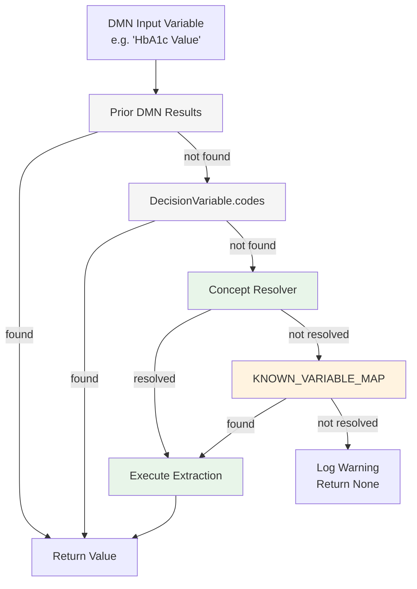
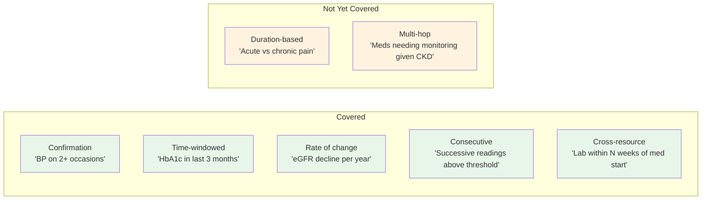

# Clinical Data Question Answering

This document describes how `acp-writer` answers clinical questions about patient data from FHIR IPS (International Patient Summary) bundles. The system extracts patient data to supply input values for DMN decision execution and care plan composition.

## Architecture

The system uses a **layered resolution strategy** — each layer is more capable but more expensive. For most clinical questions, the deterministic layers answer without any LLM calls.



### Layer 1: Prior DMN Results

When DMN models are chained (one model's output feeds another's input), the executor checks prior results first. For example, the "Monitoring Plan" model takes "Treatment Action" as input — this value comes from the "Treatment Recommendation" model's output, not from the IPS.

### Layer 2: DecisionVariable.codes

If `cpg-ingester` provides clinical terminology codes on DMN input variables (e.g., `["http://loinc.org|8480-6"]` for systolic BP), the executor uses them directly to call the extraction functions. This is the most reliable path — exact code matching, no ambiguity.

### Layer 3: Concept Resolver

A deterministic clinical term-to-code mapper (`acp-writer/src/acp_writer/tools/concept_resolver.py`) that handles the common 80% of clinical concepts without any LLM calls:

- **60+ observation terms** → LOINC codes (vitals, labs, scores)
- **20+ condition terms** → SNOMED codes with hierarchy (CKD stage variants)
- **Drug class membership** → sets of RxNorm codes (ACE inhibitors, statins, beta-blockers, CCBs, etc.)
- **Medication names** → specific RxNorm codes
- **Synonym handling** — "blood sugar" → fasting glucose, "A1C" → HbA1c, "high blood pressure" → hypertension
- **Computed values** — patient age from birthDate, BMI from height + weight

### Layer 4: Legacy Variable Map

A 6-entry hardcoded map (`KNOWN_VARIABLE_MAP`) for backward compatibility. The concept resolver supersedes it for all covered concepts.

## Extraction Functions

All extraction functions are in `acp-writer/src/acp_writer/tools/ips_extractor.py` and return an `ExtractionResult` with `found`, `value`, `unit`, `date`, `fhir_reference`, and `resource_type`.

| Function | FHIR Resource | What it returns |
|---|---|---|
| `extract_observation` | Observation | Most recent value by code. Supports `valueQuantity`, `valueCodeableConcept`, `valueString`, `valueBoolean`, `valueRange`. Checks both top-level code and components (for panels like BP). |
| `extract_condition` | Condition | Boolean: active condition with matching code present? Excludes resolved/inactive/remission. |
| `extract_medication` | MedicationStatement, MedicationRequest | Boolean: active medication with matching code present? Excludes cancelled/entered-in-error/stopped. |
| `extract_allergy` | AllergyIntolerance | Boolean: active allergy with matching code present? |
| `extract_procedure` | Procedure | Boolean: procedure with matching code present? Excludes entered-in-error/not-done. |
| `extract_family_history` | FamilyMemberHistory | Boolean: family history entry with matching condition code? |
| `extract_diagnostic_report` | DiagnosticReport | Boolean: report with matching code present? Excludes entered-in-error/cancelled. |
| `extract_patient_age` | Patient | Computed age in years from birthDate relative to a reference date. |

## Temporal Queries

> **Note:** The temporal primitives and LLM-assisted layers described below are NOT wired into the production DMN executor. They are currently reachable only from the benchmark backends and the QA agent. The production extraction path is: prior DMN results → `DecisionVariable.codes` → concept resolver → `KNOWN_VARIABLE_MAP`. Wiring temporal extraction into the production executor is future work tracked by GitHub issue #86.

For questions requiring temporal reasoning, the system builds an in-memory **temporal index** (`acp-writer/src/acp_writer/tools/temporal_index.py`) that groups observations by code and date, then provides five named primitives (`acp-writer/src/acp_writer/tools/temporal_queries.py`):

| Primitive | What it computes | Example |
|---|---|---|
| `observations_in_window` | All observations of a code within a time window | "HbA1c readings in the last 3 months" |
| `observation_count` | Count of observations matching a threshold in a window | "How many BP readings ≥ 140 in the past 3 months?" |
| `consecutive_above` | Count from most recent backward, stopping at first at-or-below | "Consecutive high BP readings" |
| `rate_of_change` | Least-squares slope normalized per year | "eGFR decline rate" |
| `cross_resource_temporal` | Whether a target observation exists within a window after an anchor medication start | "Was BMP drawn within 2 weeks of starting lisinopril?" |

Temporal results include provenance (FHIR references) and data quality notes when undated observations were excluded from the query.

### Temporal Pattern Coverage

These primitives were derived from analysis of 42+ real clinical practice guidelines:



## Benchmarking

The QA system includes a benchmark harness (`acp-writer/src/acp_writer/benchmark/`) for measuring accuracy:

```bash
# Run the 50-question smoke suite
python -m acp_writer.benchmark run --suite smoke --backend current --no-mlflow

# Run the 200-question standard suite
python -m acp_writer.benchmark run --suite standard --backend current --no-mlflow
```

Three registered backends: `current` (deterministic), `graph` (NetworkX), `llm-assisted` (query planner + tool agent). Use `python -m acp_writer.benchmark list` to see available suites and backends.

See `acp-writer/benchmarks/README.md` for details on adding test cases and backends.

### Additional modules

- **`acp-writer/src/acp_writer/tools/ips_serializer.py`** — condensed IPS serialization for LLM context (83% fewer tokens)
- **`acp-writer/src/acp_writer/tools/query_planner.py`** — LLM query plan synthesis (text → validated JSON plan)
- **`acp-writer/src/acp_writer/tools/qa_agent.py`** — LangGraph agent with extraction tools for complex questions

### Benchmark design note

Most suite cases carry a hand-authored `structured_intent`, so the 98%/74.5% scores measure execution of correct query plans plus concept-resolver natural language resolution (where intent is absent), not free-form question understanding.

## Design Decisions

- **DMN is the sole clinical logic formalism.** No CQL engine. Temporal semantics are encoded in named Python primitives whose parameters appear in the audit trail.
- **Deterministic first, LLM fallback.** The concept resolver + temporal primitives handle 98% of smoke suite questions without any LLM calls. An LLM-assisted backend exists for the long tail.
- **Graph traversal evaluated and set aside.** A NetworkX graph-backed backend was benchmarked against the flat deterministic approach on a 200-question suite with enriched FHIR bundles containing inter-resource references. Both scored 74.5%. Graph adds infrastructure complexity without measurable accuracy improvement at IPS scale.
